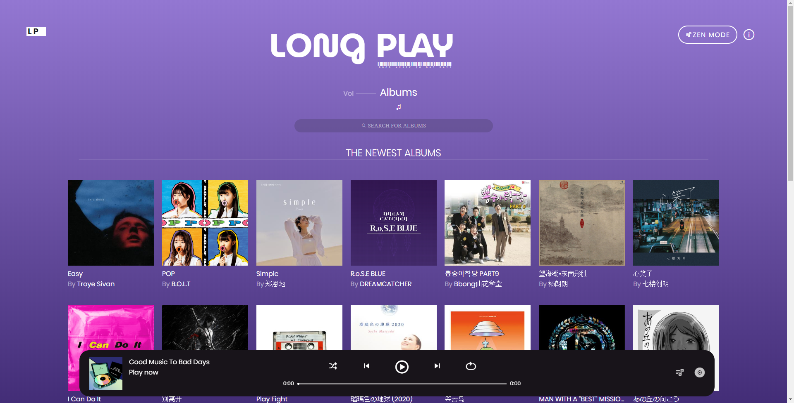
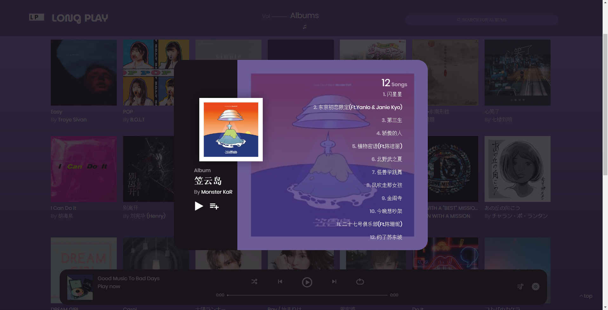
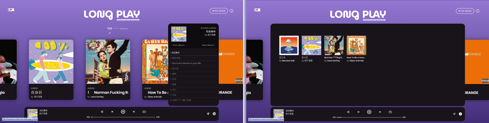
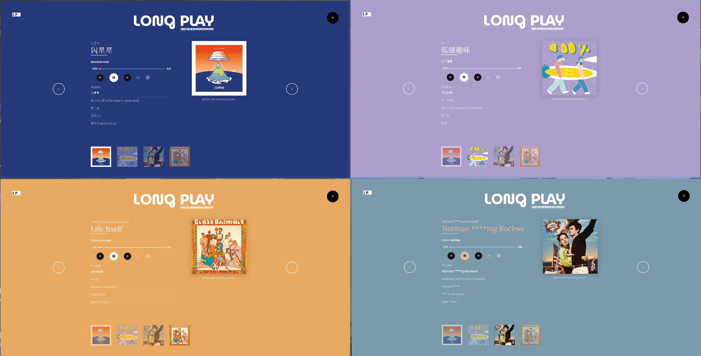

# Long Play Music V1

---------

Long Play是一个采用react技术栈编写的Web音乐网站（react hooks+redux+immer）
[在线Demo](http://116.62.146.32:3001/)

网站采用rem布局，已做基础优化。

移动端请访问[Long Play Mobile版](https://github.com/ghostiin/LongPlay-Mobile.git)

## 技术栈

这个项目后端使用 @[Binaryify](https://github.com/Binaryify)/**[NeteaseCloudMusicApi](https://github.com/Binaryify/NeteaseCloudMusicApi)**，感谢大佬

前端技术栈

- React
- redux ，redux-react ，redux-thunk
- immer.js
- Styled-Components
- axios
- react-lazyload，better-scroll，lodash等工具，使用eslint+prettier来美化和规范代码

## 功能介绍

Long Play提供以专辑为playlist的音乐体验，提供完整的专辑收藏/播放器功能

1. 首页推荐

- [x] 使用better-scroll封装成项目的scroll基础组件并在项目里多处复用，比如推荐页面的横向scroll
- [x] 网站使用rem布局，设计翻转卡片样式，增加趣味性

2. 专辑搜索+最新专辑

- [x] 对于可能的高频率输入连续触发搜索的问题，使用防抖函数进行了优化
- [x] 专辑列表的展示使用grid布局，可自适应
- [x] 添加加载loading动画，提升用户体验

3. 专辑详情页

- [x] 使用react portals封装modal组件，使用modal组件来展示专辑详情

4. 播放器相关

- [x] 封装select组件，playlist组件和playbox组件在此基础上完成
- [ ] 收藏专辑会被存入local storage，下次打开即可立即开始收听

- [x] 对于收藏专辑，使用rgbaster.js提取专辑封面中占比最大的亮色和暗色，zen player页面随专辑封面取色而变色，提升网站精致度和使用体验

## TO-DOS

- [ ] 增加分页功能
- [ ] 增加更丰富功能，eg. 使用genius api 添加歌词解析模块
- [ ] 添加“一键删除全部收藏专辑”功能
- [ ] 在播放前/收藏专辑前提前识别该专辑是否有合法收听资源（比如网易云vip&收费专辑在未登录状态下无法获取播放资源的）

- [ ] 增加网易云登录功能（需https）
- [ ] 增加PWA支持（需https）

----------------------------------------------------

- 已过时 [v0.99](http://116.62.146.32:3010/)

- 开发笔记 [notion](https://www.notion.so/LongPlay-a12c316b58df4e519279d3078b05a341)